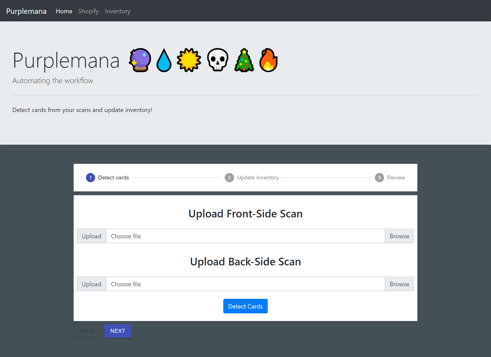
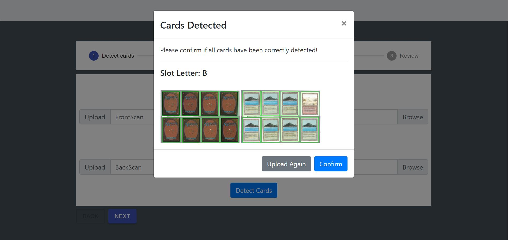
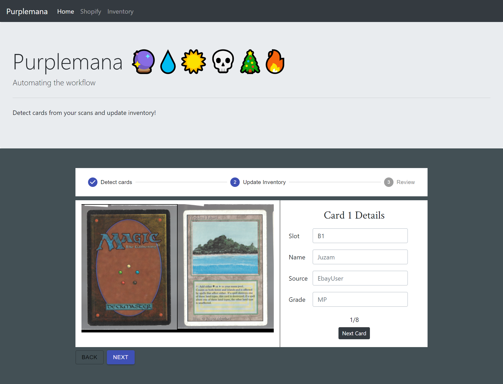
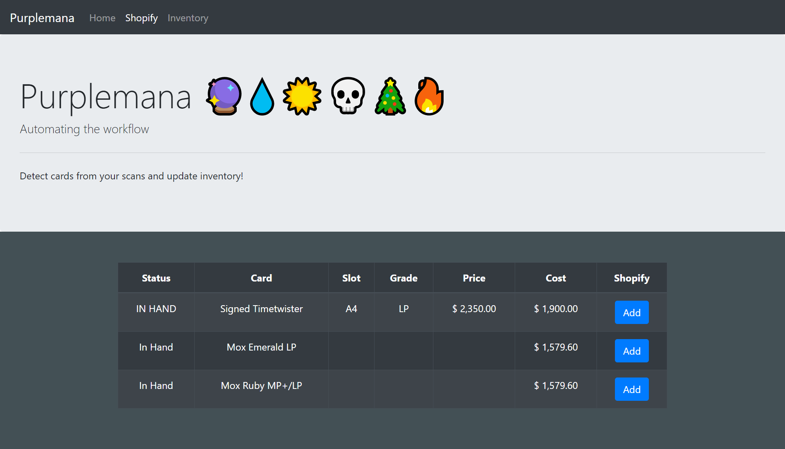
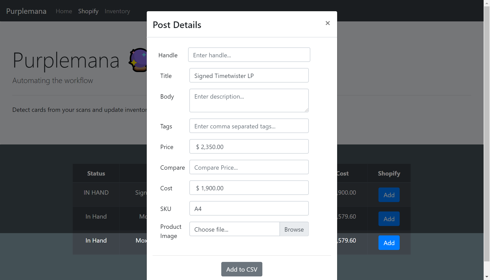

# React Front-end for Purplemana

## About
This application is a React front-end intended to provide the Purplemana staff (MTG Traders) an easy-to-use UI to update and interact with
their inventory, stored in a shared google drive, and post products to their shopify store. 
Initially, the entire application was being developed in Python, using streamlit, however, due to scalibility limitations, 
we decided to go for a React/Node.js/Express/Python application. 
You may view the Node.js, Express, and Python Backend <a href="https://github.com/mustafalii/Purplemana-Backend">here</a>, 
and the Streamlit application <a href="https://github.com/mustafalii/Purplemana-Dashboard">here</a>.


**Note**: This application is still in development. Moreover, this application will not be used by any customers, hence, little attention is being given to developing an attractive UI design, as compared to its ease of use.

## In Action


### Home:
1. Upload Scanned Images.
2. The backend processes the images and sends detected cards, cropped cards, and detected slot letter.
3. The user is asked to enter details for each of the card crops.





### Shopify:
1. Fetch "In Hand" items from inventory.
2. Items are displayed. User selects item and enters details for each product.
3. Details added to a shopify CSV that can be imported directly in the store



### Inventory:
Inventory is fetched from google drive and displayed in a table.

## Usage
Assuming you have the backend set up, you may start this app by cloning and then:

```
npm install 
npm start
```

## Note
This application is still in development. 
